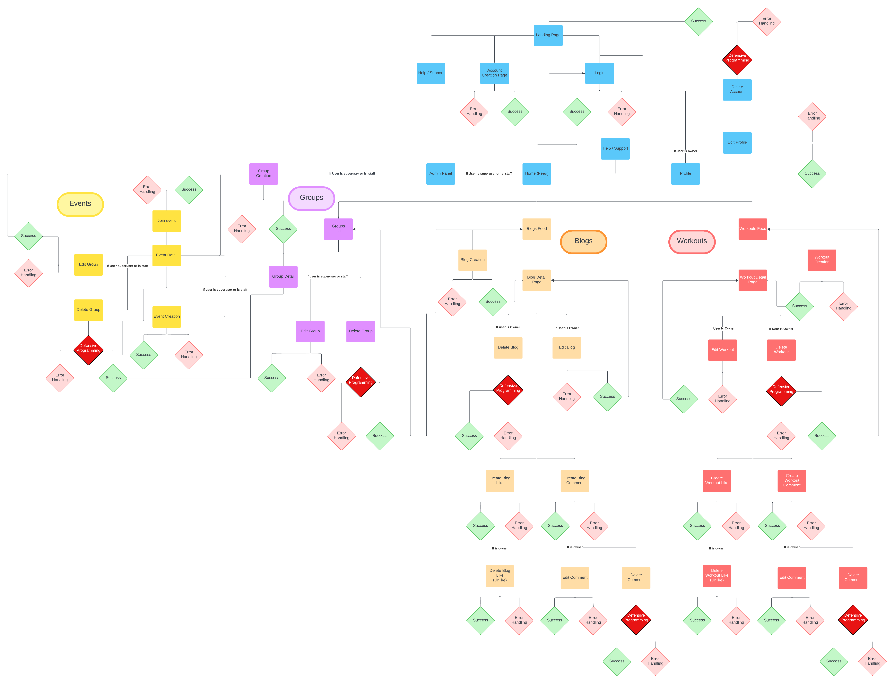

# FitTribe Frontend

**Developer : Radleigh Smith**

Welcome to the FitTribe frontend documentation. Developed with ReactJS, FitTribe's frontend provides a dynamic and engaging interface for our users. Here, members can explore and share their fitness journeys, interact with others in the community, and access a variety of fitness resources and tutorials. The intuitive design ensures a user-friendly experience, allowing users to create, update, and delete posts, follow other users, and participate in discussions through comments. This documentation will guide you through the features and functionalities available on FitTribe.

**Live links:**

Live Site Link: [FitTribe](https://fittribe-876c83cc52a2.herokuapp.com/)

Live API Site Link: [FitTribe API Backend](https://fit-tribe-api-97fb1c20a2ee.herokuapp.com/)

Backend Repo Link: [FitTribe Backend Repo](https://github.com/RadleighSmith/fit-tribe-api)

## Contents

[Planning](#planning)

- [The Strategy Plane](#the-strategy-plane)

- [The Scope Plane](#the-scope-plane)

- [The Structure Plane](#the-structure-plane)

- [The Skeleton Plane](#the-skeleton-plane)

- [The Surface Plane](#the-surface-plane)

[Features](#features)

- [Current Features](#current-features)

- [Future Features](#future-features)

[Languages](#languages)

[Frameworks and Libraries](#frameworks-and-libraries)

[Tools and Technologies](#tools-and-technologies)

[Testing and Validation](#testing-and-validation)

[Bugs & Fixes](#bugs--fixes)

[Cloning this Repository](#cloning-this-repository)

[Forking a Branch](#forking-a-branch)

[Credits](#credits)

[Achnowledgements](#achnowledgements)

--- 

## Planning

### The Strategy Plane

#### Why We Are Building the Project:

The primary motivation behind this project is to create a centralized platform for fitness enthusiasts to connect, share, and support each other in their fitness journeys. Current fitness resources are fragmented across various platforms, making it challenging for users to find comprehensive information and engage with a supportive community. By addressing these issues, we aim to provide a safe, privacy-focused space for users to achieve their fitness goals.

#### Product Description:

Our fitness social media site is designed to be a comprehensive platform where users can create accounts, log in, and share their fitness experiences through workout posts, blogs, and regular updates. Users can follow other members, like and comment on posts, view profiles, and join groups centered around specific fitness interests. The platform is built with user safety in mind, incorporating robust privacy settings and age verification to ensure all members are over the age of 18.

#### Target Audience:

Our target audience includes:
- Adults aged over 18.
- Fitness enthusiasts looking for a community to share and gain knowledge.
- Gym-goers seeking workout inspiration and tips.
- Personal trainers and fitness professionals wanting to connect with clients and peers.
- Nutritionists interested in sharing and learning about diet and fitness.
- Health-conscious individuals aiming to improve their lifestyle.
- Athletes seeking specialized fitness content and community support.

#### Problem Statement:

There is currently a lack of centralized platforms where fitness enthusiasts can connect, share, and support each other while ensuring their privacy and safety. This fragmentation makes it difficult for users to find reliable fitness information and engage with a cohesive community.

#### Project Aim:

Our aim is to develop a user-friendly fitness social media platform that provides a centralized space for users to share workout routines, blogs, and regular posts, connect with like-minded individuals, and participate in supportive communities. We are committed to creating an environment where users can interact freely, confident in the knowledge that their privacy is protected and all users are over the age of 18. Through this, we hope to empower users to achieve their fitness goals in a safe and supportive online community.
By focusing on these aspects within the strategy plane, we ensure that our project is aligned with user needs and our product objectives, setting a strong foundation for the subsequent stages of development.

### The Scope Plane

Guided by our product strategy, the scope plane outlines the specific features and functions that our fitness social media site will include. These features are designed to meet the needs of our target audience and support our project aims.

#### User Accounts:
- Account creation and secure login
- Profile customization (profile picture, bio, profile banner, etc.)
- Age verification process to ensure users are over 18

#### Content Creation and Sharing:
- Ability to create and share workout posts (including text, images, and videos)
- Blog writing and publishing platform
- Regular posts for status updates and fitness milestones

#### Interaction and Community Engagement:
- Follow/unfollow other users
- Like and comment on blogs and workouts
- View other users' profiles and blogs and workouts
- Join and participate in groups and group events centered around specific fitness interests

#### Privacy and Safety:
- Content moderation tools to prevent inappropriate or harmful content
- Secure authentication to protect user accounts

#### Navigation and User Interface:
- Intuitive home feed displaying recent posts from followed users and groups
- Search function to find users and specific posts
- Notifications for interactions (likes, comments, follows)

__Exclusions:__

To maintain focus and manage development resources effectively, certain features will be outside the scope of the initial release. These include:

- __Advanced Fitness Tracking and Analytics:__ Comprehensive tracking of fitness metrics, detailed analytics, and performance summaries.

- __Integration with External Fitness Devices and Apps__: Compatibility with fitness trackers, smartwatches, and other health apps.

- __E-commerce Functionalities:__ Features for selling fitness products or services directly on the platform.

- __Educational Content:__ In-depth articles, videos, and tutorials related to fitness, nutrition, and wellness.

- __Group Discussion Threads and Posts:__ Advanced functionalities for group discussions and community posts.

- __Enhanced Privacy Settings:__ More robust options for controlling who can view user content and profile information.

- __User Instant Messaging:__ Real-time chat capabilities between users.

- __User-Generated Events:__ Features allowing users to create, manage, and join fitness-related events.

- __Custom Workout Plans:__ Personalized workout routines generated based on user goals and preferences.

- __Diet and Nutrition Tracking:__ Tools for logging meals, tracking macros, and receiving dietary advice.

- __Professional Consultations:__ Integration with fitness trainers, nutritionists, and health consultants for booking sessions

- __Video Streaming and Live Workouts:__ Hosting live workout sessions and video classes.

- __Automated Workout Suggestions:__ AI-driven suggestions for workouts based on user performance and goals.

- __Leaderboard and Competitions:__ Gamification elements such as leaderboards and fitness challenges.

- __Detailed Progress Reports:__ Generation of detailed reports tracking user progress over time.

- __Third-Party App Integrations:__ Seamless integration with other popular health and fitness apps.

- __Advanced Social Features:__ Including features like fitness communities, follower recommendations, and trending workouts.

By clearly defining the scope, we ensure that our development efforts are concentrated on delivering the most critical features and functions that align with our strategic goals and meet the needs of our users. This focused approach allows us to create a robust and user-friendly platform within a manageable timeline and budget.

#### User Stories:

__User stories here__ 

### The Structure Plane

The structure plane focuses on defining how the various features and functions of our fitness social media site fit together. This includes outlining the information architecture and the user flow, ensuring a seamless and intuitive experience for our users.

#### Site Map

This site diagram, crafted using [Lucidchart](https://www.lucidchart.com/), offers a structured overview of our platform's architecture and user navigation. It serves as a clear visualization of the pathways and interactions within the system, with each element precisely positioned to illustrate the flow of information and user movement.

---
#### Database Plan

This diagram presents a comprehensive overview of our database structure, meticulously crafted using Lucidchart. It visually represents the relationships between various entities and the flow of data within our system.

We've chosen PostgreSQL as our database solution for its robust features, reliability, and cost-effectiveness as an open-source relational database system. To meet our hosting needs, we've selected ElephantSQL, a trusted platform renowned for its seamless PostgreSQL hosting services. This strategic choice ensures our database management is efficient, secure, and scalable, aligning perfectly with our business objectives.

### The Skeleton Plane

### The Surface Plane

---

## Features

### Current Features

### Future Features

## Languages

## Frameworks and Libraries

## Tools and Technologies

## Testing and Validation

## Bugs & Fixes

## Cloning this Repository

## Forking a Branch

## Credits

## Achnowledgements

