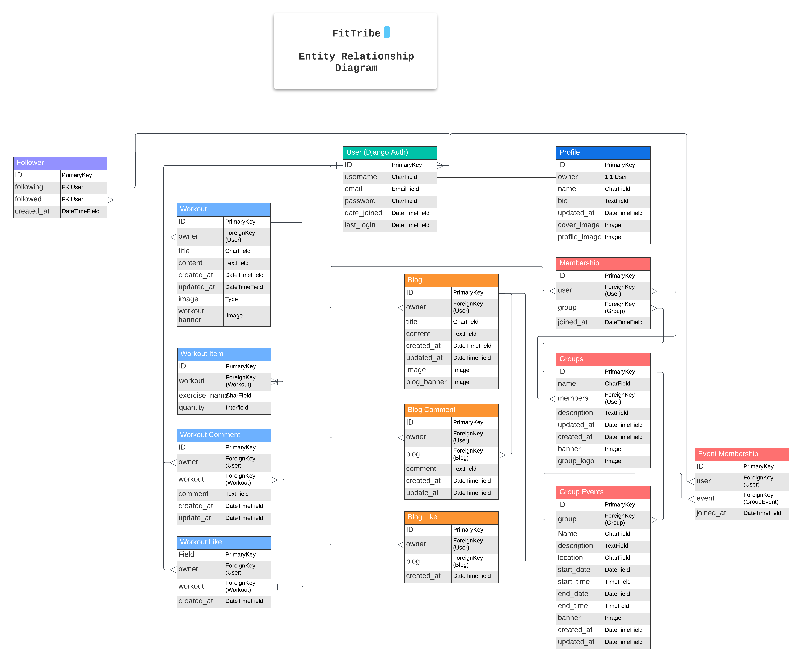

# FitTribe Frontend

**Developer : Radleigh Smith**

Welcome to the FitTribe frontend documentation. Developed with ReactJS, FitTribe's frontend provides a dynamic and engaging interface for our users. Here, members can explore and share their fitness journeys, interact with others in the community, and access a variety of fitness resources and tutorials. The intuitive design ensures a user-friendly experience, allowing users to create, update, and delete posts, follow other users, and participate in discussions through comments. This documentation will guide you through the features and functionalities available on FitTribe.

**Live links:**

Live Site Link: [FitTribe](https://fittribe-876c83cc52a2.herokuapp.com/)

Live API Site Link: [FitTribe API Backend](https://fit-tribe-api-97fb1c20a2ee.herokuapp.com/)

Backend Repo Link: [FitTribe Backend Repo](https://github.com/RadleighSmith/fit-tribe-api)


## Contents

[Planning](#planning)

- [The Strategy Plane](#the-strategy-plane)

- [The Scope Plane](#the-scope-plane)

- [The Structure Plane](#the-structure-plane)

- [The Skeleton Plane](#the-skeleton-plane)

- [The Surface Plane](#the-surface-plane)

[Features](#features)

- [Current Features](#current-features)

- [Future Features](#future-features)

[Languages](#languages)

[Frameworks and Libraries](#frameworks-and-libraries)

[Tools and Technologies](#tools-and-technologies)

[Testing and Validation](#testing-and-validation)

[Bugs & Fixes](#bugs--fixes)

[Cloning this Repository](#cloning-this-repository)

[Forking a Branch](#forking-a-branch)

[Connecting to the FitTribe API](#connecting-to-the-fittribe-api)

[Deployment](#deployment)

[Credits](#credits)

[Achnowledgements](#achnowledgements)

--- 

## Planning

### The Strategy Plane

#### Why We Are Building the Project:

The primary motivation behind this project is to create a centralized platform for fitness enthusiasts to connect, share, and support each other in their fitness journeys. Current fitness resources are fragmented across various platforms, making it challenging for users to find comprehensive information and engage with a supportive community. By addressing these issues, we aim to provide a safe, privacy-focused space for users to achieve their fitness goals.

#### Product Description:

Our fitness social media site is designed to be a comprehensive platform where users can create accounts, log in, and share their fitness experiences through workout posts, blogs, and regular updates. Users can follow other members, like and comment on posts, view profiles, and join groups centered around specific fitness interests. The platform is built with user safety in mind, incorporating robust privacy settings and age verification to ensure all members are over the age of 18.

#### Target Audience:

Our target audience includes:
- Adults aged over 18.
- Fitness enthusiasts looking for a community to share and gain knowledge.
- Gym-goers seeking workout inspiration and tips.
- Personal trainers and fitness professionals wanting to connect with clients and peers.
- Nutritionists interested in sharing and learning about diet and fitness.
- Health-conscious individuals aiming to improve their lifestyle.
- Athletes seeking specialized fitness content and community support.

#### Problem Statement:

There is currently a lack of centralized platforms where fitness enthusiasts can connect, share, and support each other while ensuring their privacy and safety. This fragmentation makes it difficult for users to find reliable fitness information and engage with a cohesive community.

#### Project Aim:

Our aim is to develop a user-friendly fitness social media platform that provides a centralized space for users to share workout routines, blogs, and regular posts, connect with like-minded individuals, and participate in supportive communities. We are committed to creating an environment where users can interact freely, confident in the knowledge that their privacy is protected and all users are over the age of 18. Through this, we hope to empower users to achieve their fitness goals in a safe and supportive online community.
By focusing on these aspects within the strategy plane, we ensure that our project is aligned with user needs and our product objectives, setting a strong foundation for the subsequent stages of development.


### The Scope Plane

Guided by our product strategy, the scope plane outlines the specific features and functions that our fitness social media site will include. These features are designed to meet the needs of our target audience and support our project aims.

#### User Accounts:
- Account creation and secure login
- Profile customization (profile picture, bio, profile banner, etc.)
- Age verification process to ensure users are over 18

#### Content Creation and Sharing:
- Ability to create and share workout posts (including text, images, and videos)
- Blog writing and publishing platform
- Regular posts for status updates and fitness milestones

#### Interaction and Community Engagement:
- Follow/unfollow other users
- Like and comment on blogs and workouts
- View other users' profiles and blogs and workouts
- Join and participate in groups and group events centered around specific fitness interests

#### Privacy and Safety:
- Content moderation tools to prevent inappropriate or harmful content
- Secure authentication to protect user accounts

#### Navigation and User Interface:
- Intuitive home feed displaying recent posts from followed users and groups
- Search function to find users and specific posts
- Notifications for interactions (likes, comments, follows)

__Exclusions:__

To maintain focus and manage development resources effectively, certain features will be outside the scope of the initial release. These include:

- __Advanced Fitness Tracking and Analytics:__ Comprehensive tracking of fitness metrics, detailed analytics, and performance summaries.

- __Integration with External Fitness Devices and Apps__: Compatibility with fitness trackers, smartwatches, and other health apps.

- __E-commerce Functionalities:__ Features for selling fitness products or services directly on the platform.

- __Educational Content:__ In-depth articles, videos, and tutorials related to fitness, nutrition, and wellness.

- __Group Discussion Threads and Posts:__ Advanced functionalities for group discussions and community posts.

- __Enhanced Privacy Settings:__ More robust options for controlling who can view user content and profile information.

- __User Instant Messaging:__ Real-time chat capabilities between users.

- __User-Generated Events:__ Features allowing users to create, manage, and join fitness-related events.

- __Custom Workout Plans:__ Personalized workout routines generated based on user goals and preferences.

- __Diet and Nutrition Tracking:__ Tools for logging meals, tracking macros, and receiving dietary advice.

- __Professional Consultations:__ Integration with fitness trainers, nutritionists, and health consultants for booking sessions

- __Video Streaming and Live Workouts:__ Hosting live workout sessions and video classes.

- __Automated Workout Suggestions:__ AI-driven suggestions for workouts based on user performance and goals.

- __Leaderboard and Competitions:__ Gamification elements such as leaderboards and fitness challenges.

- __Detailed Progress Reports:__ Generation of detailed reports tracking user progress over time.

- __Third-Party App Integrations:__ Seamless integration with other popular health and fitness apps.

- __Advanced Social Features:__ Including features like fitness communities, follower recommendations, and trending workouts.

By clearly defining the scope, we ensure that our development efforts are concentrated on delivering the most critical features and functions that align with our strategic goals and meet the needs of our users. This focused approach allows us to create a robust and user-friendly platform within a manageable timeline and budget.

#### Agile Plan for FitTribe Development

The agile plan for FitTribe development is structured into six sprints, each focusing on key features essential for the platform's success. The initial sprint targets Authentication and Navigation, establishing the foundational elements for user access and seamless navigation. Subsequent sprints build upon this foundation, with Sprint 2 dedicated to User Profiles, enabling users to create and manage their profiles. Sprint 3 focuses on Blogs, including comments and likes, fostering community engagement through content sharing. Sprint 4 integrates Following/Followers and Groups, facilitating user connections and community building. Sprint 5 addresses Group Events, allowing for organized group activities and events. The final sprint, Sprint 6, includes Final Touches and Error Handling, ensuring a polished user experience with personalized landing pages, responsive navigation, and a clear 404 error page. This agile approach is utilized for its iterative nature, allowing for continuous feedback, rapid adjustments, and the delivery of high-priority features in a phased manner. By breaking down the project into manageable sprints, the team can maintain focus, adapt to changes, and consistently deliver value to users.

Team Velocity: 20 story points per sprint

_**Sprint 1: Authentication and Navigation**_

**User Stories for Authentication and Navigation**

| **User Story**                                                                                                    | **Story Points** |
|-------------------------------------------------------------------------------------------------------------------|------------------|
| As a new user, I can create an account so that I can access the FitTribe platform and start using its features.    | 8                |
| As a returning user, I can login so that I can access my account and personalized content on the FitTribe platform.| 6                |
| As a logged-in user, I can logout so that I can securely end my session on the FitTribe platform.                  | 3                |
| As a user, I can see a header on every page so that I can easily navigate the FitTribe platform and access key features. | 3            |

**Total Story Points**: 20

**_Sprint 2: User Profiles_**

**User Stories for User Profiles**

| **User Story**                                                                                                    | **Story Points** |
|-------------------------------------------------------------------------------------------------------------------|------------------|
| As a new user, I can create a profile so that I can share information about myself and my fitness goals with the FitTribe community. | 5          |
| As a user, I can edit my profile so that I can update my personal information as needed.                          | 8                |
| As a user, I can upload and update my profile cover photo so that I can personalize my profile page.              | 5                |
| As a user, I can see a header on every page so that I can easily navigate the FitTribe platform and access key features. | 2            |

**Total Story Points**: 20

**_Sprint 3: Blogs (including Comments and Likes)_**

**User Stories for Blogs**

| **User Story**                                                                                                    | **Story Points** |
|-------------------------------------------------------------------------------------------------------------------|------------------|
| As an authenticated user, I can create a blog so that I can share my fitness experiences, tips, and knowledge with the FitTribe community. | 8           |
| As a user, I can read blogs so that I can gain insights, tips, and information from other users' fitness experiences and knowledge. | 6       |
| As a user, I can update my blog posts so that I can make corrections, add new information, or improve the content after publishing. | 3      |
| As a user, I can delete my blog posts so that I can remove content I no longer want to share on the FitTribe platform. | 3           |

**Total Story Points**: 20

**_Sprint 4: Following / Followers and Groups_**

**User Stories for Following / Followers and Groups**

| **User Story**                                                                                                    | **Story Points** |
|-------------------------------------------------------------------------------------------------------------------|------------------|
| As a user, I can follow other users so that I can stay updated with their activities and content on the platform.  | 5                |
| As a user, I can unfollow other users so that I can stop receiving updates from their activities and content on the platform. | 5          |
| As an admin, I can create a group so that I can facilitate community engagement and organize members around common interests on the FitTribe platform. | 5      |
| As a user, I can view the details of a group so that I can learn more about the group's purpose and activities.    | 5                |

**Total Story Points**: 20

**_Sprint 5: Group Events_**

**User Stories for Group Events**

| **User Story**                                                                                                    | **Story Points** |
|-------------------------------------------------------------------------------------------------------------------|------------------|
| As an admin, I can create an event within a group so that members can participate in scheduled activities.         | 5                |
| As a user, I can view the details of an event so that I can learn more about the scheduled activities and participate. | 5           |
| As an admin, I can update the details of an event so that I can keep the event's information current and relevant. | 5                |
| As an admin, I can delete an event so that I can remove events that are no longer relevant or active.              | 5                |

**Total Story Points**: 20

**_Sprint 6: Final Touches and Error Handling_**

**User Stories for Final Touches and Error Handling**

| **User Story**                                                                                                    | **Story Points** |
|-------------------------------------------------------------------------------------------------------------------|------------------|
| As a user, I can land on a personalized landing page based on my authentication status so that I can access relevant content and information about the FitTribe platform. | 10           |
| As a user, I can access a side navigation menu on larger devices so that I can easily navigate to different sections of the FitTribe platform. | 5            |
| As a user, I can see a 404 error page when I navigate to a non-existent page so that I know the page is not available. | 5          |

**Total Story Points**: 20


### The Structure Plane

The structure plane focuses on defining how the various features and functions of our fitness social media site fit together. This includes outlining the information architecture and the user flow, ensuring a seamless and intuitive experience for our users.

#### Site Map

This site diagram, crafted using [Lucidchart](https://www.lucidchart.com/), offers a structured overview of our platform's architecture and user navigation. It serves as a clear visualization of the pathways and interactions within the system, with each element precisely positioned to illustrate the flow of information and user movement.


---
#### Database Plan

This diagram presents a comprehensive overview of our database structure, meticulously crafted using Lucidchart. It visually represents the relationships between various entities and the flow of data within our system.

We've chosen PostgreSQL as our database solution for its robust features, reliability, and cost-effectiveness as an open-source relational database system. To meet our hosting needs, we've selected ElephantSQL, a trusted platform renowned for its seamless PostgreSQL hosting services. This strategic choice ensures our database management is efficient, secure, and scalable, aligning perfectly with our business objectives.



### The Skeleton Plane

We developed wireframes for desktop, tablet, and mobile views to outline the layout and design of our website across different devices. These wireframes act as a blueprint for our site's structure, showing the placement of elements, navigation flow, and overall user interface design. By creating these wireframes, we can clearly communicate our design concepts, collaborate with stakeholders, gather feedback, and make informed decisions before moving into the development phase.

Using [Uizard's](https://app.uizard.io/), an innovative wireframing tool, we streamlined the wireframing process, enhancing our design iteration cycles. [Uizard's](https://app.uizard.io/) intuitive interface allows us to quickly transform ideas into concrete wireframes, saving time and effort. With [Uizard's](https://app.uizard.io/), we can easily experiment with different layouts, iterate on design variations, and visualize our website's appearance and functionality across various devices.

#### Wireframes:

**Landing Page: (This is the Homepage of a user that is not authenticated)**

<details>
<summary>
Desktop
</summary>


</details>
<details>
<summary>
Tablet
</summary>
 

</details>
<details>
<summary>
Mobile
</summary>


</details>

<br>

**Homepage: (This is the homepage of authenticated users)**

<details>
<summary>
Desktop
</summary>


</details>
<details>
<summary>
Tablet
</summary>
 

</details>
<details>
<summary>
Mobile
</summary>


</details>

<br>

**Login Page:**

<details>
<summary>
Desktop
</summary>


</details>
<details>
<summary>
Tablet
</summary>
 

</details>
<details>
<summary>
Mobile
</summary>


</details>

<br>

**Account Creation:**

<details>
<summary>
Desktop
</summary>


</details>
<details>
<summary>
Tablet
</summary>
 

</details>
<details>
<summary>
Mobile
</summary>


</details>

<br>

**Blog Creation Page**

<details>
<summary>
Desktop
</summary>


</details>
<details>
<summary>
Tablet
</summary>
 

</details>
<details>
<summary>
Mobile
</summary>


</details>

<br>

**Workout Creation Page**

<details>
<summary>
Desktop
</summary>


</details>
<details>
<summary>
Tablet
</summary>
 

</details>
<details>
<summary>
Mobile
</summary>


</details>

<br>

**Blog / Workout Detail Page**

<details>
<summary>
Desktop
</summary>


</details>
<details>
<summary>
Tablet
</summary>
 

</details>
<details>
<summary>
Mobile
</summary>


</details>

<br>

**Profile Page**

<details>
<summary>
Desktop
</summary>


</details>
<details>
<summary>
Tablet
</summary>
 

</details>
<details>
<summary>
Mobile
</summary>


</details>

<br>

**Admin Page**

<details>
<summary>
Desktop
</summary>


</details>
<details>
<summary>
Tablet
</summary>
 

</details>
<details>
<summary>
Mobile
</summary>


</details>

<br>

**Group Creation Page**

<details>
<summary>
Desktop
</summary>


</details>
<details>
<summary>
Tablet
</summary>
 

</details>
<details>
<summary>
Mobile
</summary>


</details>

<br>

**Group Detail Page**

<details>
<summary>
Desktop
</summary>


</details>
<details>
<summary>
Tablet
</summary>
 

</details>
<details>
<summary>
Mobile
</summary>


</details>

<br>

**Event Creation Page**

<details>
<summary>
Desktop
</summary>


</details>
<details>
<summary>
Tablet
</summary>
 

</details>
<details>
<summary>
Mobile
</summary>


</details>

<br>

**Event Details Page**

<details>
<summary>
Desktop
</summary>


</details>
<details>
<summary>
Tablet
</summary>
 

</details>
<details>
<summary>
Mobile
</summary>


</details>

<br>

### The Surface Plane

#### Colour Scheme

In the colour scheme section of our Surface Plane, we've carefully selected a palette that enhances the overall user experience while reflecting our design goals. Our approach balances clean, minimalist design with vibrant accents to guide user attention and encourage engagement.

__Background and Component Colours__

- __Contrasting Background:__ #F0F0F0 - This light grey shade provides a subtle contrast against the primary white background, adding depth and dimension to the overall design.

- __Component Background:__ #FFFFFF - Pure white is used for the background of components, creating a clean and spacious feel that ensures readability and focus on content.

__Primary and Accent Colours__

__Main Colour:__ #5ac8fa - A vibrant blue hue is used for primary elements and call-to-action items, drawing users' attention and encouraging interaction. This colour adds a fresh and energetic vibe to the site.

__Contrast Colour:__ #2992a5 - A deeper blue is used to contrast the main blue colour, providing variety and visual interest while maintaining a cohesive colour scheme.

__Text and Shadows__

__Text Colour:__ #000000 - Black is used for text elements, ensuring maximum readability and sharp contrast against lighter backgrounds. This choice promotes clarity and ease of reading across all sections of the website.

__Shadow Colour:__ #000000 - Subtle shadows using black help to create depth and highlight interactive elements, enhancing the overall user experience.


To ensure our chosen colour scheme meets accessibility standards and provides optimal readability for all users, we employed a [contrast grid](https://contrast-grid.eightshapes.com/) to evaluate the contrast ratios between text and background colours. This systematic approach allows us to assess the colour combinations used throughout the website and verify adherence to accessibility guidelines.


Overall, our carefully curated colour scheme aims to create a harmonious and visually appealing experience for our users, balancing contrast, readability, and engagement throughout the website. This palette ensures that our design is inclusive and accessible to all users, including those with visual impairments or disabilities.

#### Typography

In crafting our website's visual identity, we've carefully selected typography to ensure optimal readability and aesthetic appeal. Our choices of Monserrat and Roboto Mono work in harmony to create a clean, modern, and distinctive appearance across all text elements.

__Content Text__

Font: Monserrat

Usage: Monserrat is used for body text, providing a clean and modern look that enhances readability. Its sleek and contemporary design ensures that lengthy descriptions and informative articles are easy to read, contributing to a seamless user experience.

__Titles and Headers__

Font: Roboto Mono

Usage: Roboto Mono is employed for titles and headers, offering a distinctive and stylish appearance that helps differentiate headings from body text. Its unique, monospaced design commands attention and adds a touch of sophistication to our headers, making them stand out while maintaining readability across different devices and screen sizes.

By combining Monserrat and Roboto Mono, we've created a balanced typographic system that ensures both functionality and visual appeal, enhancing the overall user experience on our website.

## Features

### Current Features

#### Logged Out Homepage

The **Logged Out HomePage** serves as the primary landing page for users who are not logged in. This page is designed to inform and attract new users by showcasing the key features and benefits of joining the FitTribe community. 

**Key Features:**

1. **Hero Section**:
   - **Hero Image**: A prominent and visually appealing image that represents the FitTribe community.
   - **Overlay Text**: A call-to-action overlay that includes:
     - A headline encouraging users to join the community.
     - A brief description highlighting the benefits of the community.
     - **Sign Up and Login Buttons**: Clear calls-to-action for new users to sign up or log in.

2. **Features Section**:
   - **Section Introduction**: A title introducing the main features of FitTribe.
   - **List of Features**:
     - **Workout Sharing**: Users can post their workouts and receive community feedback.
     - **Fitness Blogs**: A platform for writing and reading fitness stories and tips.
     - **Community Groups**: Users can join groups that align with their fitness interests.
     - **Interactive Engagement**: Features for liking, commenting, and following other users to maintain motivation.
   - **Additional Call to Action**: Another invitation for users to join the community with a prominent button.

This page effectively uses visuals and concise, engaging text to communicate the value of the FitTribe community, providing a strong incentive for visitors to sign up or log in.

Screenshots:

<details>
<summary>
Desktop
</summary>


</details>

<br>

<details>
<summary>
Mobile
</summary>


</details>

<br>

---

#### Sign Up Page

The **Sign Up Page** is designed to facilitate new users in creating their accounts on the FitTribe platform. This page is structured to ensure a smooth and intuitive sign-up process, providing users with clear instructions and feedback.

**Key Features:**

1. **Hero Section**:
   - **Hero Image**: A motivational image related to fitness displayed prominently to inspire new users.
   - **Overlay Elements**: 
     - **Logo**: The FitTribe logo displayed at the top for brand recognition.
     - **Sign Up Form**: Centrally placed form for user registration.

2. **Sign Up Form**:
   - **Username Field**: 
     - Input for entering a unique username.
     - Error handling to display warnings if the username is invalid or already taken.
   - **Email Field**: 
     - Input for entering the user's email address.
     - Error handling to display warnings if the email format is incorrect or already in use.
   - **Password Fields**:
     - **Password1**: Input for entering the password.
     - **Password2**: Input for confirming the password.
     - Error handling for mismatched passwords or not meeting security requirements.
   - **Error Alerts**:
     - Display of specific error messages related to each field for better user guidance.
     - Non-field errors for general sign-up issues.
   - **Sign Up and Login Links**:
     - A link directing users to the login page if they already have an account.
   - **Submit Button**: 
     - A prominent button to submit the form and create the account.

3. **Responsive Design**:
   - The layout adjusts seamlessly for different screen sizes, ensuring usability on both desktop and mobile devices.
   - Divisions for the form and image to maintain visual appeal and functionality across various devices.

This page ensures that users have a clear and easy path to join the FitTribe community, with sufficient error handling to guide them through any issues during the registration process.


Screenshots:

<details>
<summary>
Desktop
</summary>


</details>

<br>

<details>
<summary>
Mobile
</summary>


</details>

<br>

---

#### Login Page

The **Login Page** is designed to authenticate existing users on the FitTribe platform. This page is structured to provide a seamless and secure login experience with clear instructions and feedback.

**Key Features:**

1. **Hero Section**:
   - **Hero Image**: An engaging fitness-related image displayed prominently to welcome users.
   - **Overlay Elements**:
     - **Logo**: The FitTribe logo displayed at the top for brand recognition.
     - **Login Form**: Centrally placed form for user authentication.

2. **Login Form**:
   - **Username Field**:
     - Input for entering the username.
     - Error handling to display warnings if the username is incorrect or not found.
   - **Password Field**:
     - Input for entering the password.
     - Error handling to display warnings if the password is incorrect.
   - **Error Alerts**:
     - Display of specific error messages related to each field for better user guidance.
     - Non-field errors for general login issues.
   - **Sign Up and Login Links**:
     - A link directing users to the sign-up page if they do not have an account.
   - **Submit Button**:
     - A prominent button to submit the form and authenticate the user.

3. **Responsive Design**:
   - The layout adjusts seamlessly for different screen sizes, ensuring usability on both desktop and mobile devices.
   - Divisions for the form and image to maintain visual appeal and functionality across various devices.

This page ensures that users can easily log in to the FitTribe community, with sufficient error handling to guide them through any issues during the authentication process.


Screenshots:

<details>
<summary>
Desktop
</summary>


</details>

<br>

<details>
<summary>
Mobile
</summary>


</details>

<br>

---

#### Signed In Homepage (Feed)

The **Signed In Homepage (Feed)** provides a personalized feed for authenticated users, showing blog posts from followed users.

**Key Features:**

1. **Personalized Feed**:
   - **Fetch Blogs**: Uses an API call to retrieve blog posts from followed users.
   - **Error Handling**: Displays any errors encountered during the fetch process.
   - **Conditional Content**:
     - Displays a welcome message and personalized feed content.
     - Shows a list of blog posts if available.
     - Shows a message if no blog posts are available or if the user isn't following anyone.

2. **Blog Display**:
   - **Blog Card Component**: Each blog post is displayed using the **BlogCard** component, providing a consistent and visually appealing layout.

#### Blog Card Component

The **Blog Card Component** is used to display individual blog posts within the feed, showcasing key details and enabling interaction.

**Key Features:**

1. **Blog Information**:
   - **Profile Link**: Links to the profile of the blog owner, including their profile picture.
   - **Blog Title and Owner**: Displays the title of the blog and the owner's name.
   - **Date Posted**: Shows the date the blog was created.

2. **Content Display**:
   - **Sanitized Content**: Displays a preview of the blog content using `DOMPurify` to ensure safe HTML rendering.
   - **Read More Link**: Provides a link to the full blog post.

3. **Blog Image**:
   - **Conditional Display**: Displays an image associated with the blog post if available and not using the default placeholder image.

4. **Interactions**:
   - **Like/Unlike**: Allows users to like or unlike the blog post. The like button is disabled for the blog owner to prevent self-likes.
   - **Like Tooltip**: Displays a tooltip explaining why the blog owner cannot like their own post.
   - **Comments Count**: Shows the number of comments on the blog post.

5. **Responsive Design**:
   - **Adaptive Layout**: Ensures the blog card is displayed correctly across different devices and screen sizes. 

These features ensure that users have a seamless and engaging experience while interacting with the blog content on the FitTribe platform.


Screenshots:

<details>
<summary>
Desktop
</summary>


</details>

<br>

<details>
<summary>
Mobile
</summary>


</details>

<br>

---

#### Blogs Page

The **Blogs Page** is the main page for users to view all blog posts on the FitTribe platform. It allows users to browse through various blog posts, read them, and create new posts.

**Key Features:**

1. **Page Header**:
   - **Title**: The page prominently displays the title "Blogs" at the top.
   - **Error Handling**: Displays an error message if there is an issue fetching the blogs.
   - **Divider**: A visual divider below the title for better organization.

2. **Create Blog Button**:
   - **Create Blog**: A button that navigates the user to the blog creation page, allowing them to create new blog posts.

3. **Blog List**:
   - **Blog Cards**: Each blog post is represented as a card displaying a brief overview. Users can click on a card to view the full blog post.
   - **Dynamic Fetching**: The blog posts are fetched dynamically from the server and displayed as a list of cards.

4. **Responsive Design**:
   - **Layout**: The page layout is designed to be responsive, ensuring it looks good on various devices, including desktops, tablets, and mobile phones.
   - **Column Adjustment**: Blog cards adjust their layout based on the screen size to provide an optimal viewing experience.

5. **Navigation**:
   - **Links**: Users can easily navigate to the blog creation page or individual blog posts using the provided links and buttons.

This page ensures that users have a seamless experience when browsing through blog posts, viewing details, and creating new content on the platform.

Screenshots:

<details>
<summary>
Desktop
</summary>


</details>

<br>

<details>
<summary>
Mobile
</summary>


</details>

<br>

---

#### Blog Create Page

The **Blog Create Page** allows users to create new blog posts on the FitTribe platform. This page is designed to provide a smooth and intuitive experience for users to share their fitness stories, tips, and experiences.

**Key Features:**

1. **Page Header**:
   - **Title**: Displays the page title "New Blog Entry" at the top.
   - **Divider**: A visual divider below the title for better organization.

2. **Blog Form**:
   - **Title Field**: 
     - Input for entering the title of the blog post.
     - Error handling to display warnings if the title is invalid.
   - **Content Field**:
     - Rich text editor (ReactQuill) for entering the blog content.
     - Error handling for content-related issues.
   - **Cover Image Field**:
     - Dropzone for uploading a cover image.
     - Image preview and option to remove the uploaded image.
     - Error handling for invalid image files.
   - **Image Upload Field**:
     - Dropzone for uploading additional images.
     - Image preview and option to remove the uploaded image.
     - Error handling for invalid image files.

3. **Submit Button**:
   - **Publish Now**: Button to submit the form and create the blog post.
   - **Loading Spinner**: Displayed while the form is being submitted to indicate progress.

4. **Error Handling**:
   - **Field-specific Errors**: Displays specific error messages related to each form field.
   - **Non-field Errors**: Displays general error messages for any other issues during the blog creation process.

5. **Responsive Design**:
   - The layout adjusts seamlessly for different screen sizes, ensuring usability on both desktop and mobile devices.
   - Dropzones and form fields are designed to be user-friendly and accessible across various devices.

This page ensures that users can easily create and publish blog posts with sufficient error handling to guide them through any issues during the creation process.

Screenshots:

<details>
<summary>
Desktop
</summary>


</details>

<br>

<details>
<summary>
Mobile
</summary>


</details>

<br>

---

#### Blog Detail Page

The **Blog Detail Page** allows users to view a specific blog post in detail, along with its comments. Users can also interact with the blog by liking, unliking, or commenting on it.

**Key Features:**

1. **Blog Display**:
   - **Banner Image**: Displays the main image for the blog.
   - **Blog Title**: Showcases the title of the blog post.
   - **Blog Content**: Sanitized HTML content of the blog is rendered.

2. **Author Information**:
   - **Profile Link**: Link to the author’s profile with their profile picture and username.
   - **Post Date**: Displays the date the blog was posted.

3. **Interactions**:
   - **Like/Unlike Functionality**:
     - Users can like or unlike the blog post.
     - Owners of the blog cannot like their own posts.
   - **Comments**:
     - Users can add comments to the blog post.
     - Comments are displayed in a scrollable section with infinite scroll for loading more comments.

4. **Actions for Blog Owners**:
   - **Edit/Delete Options**: Blog owners have dropdown options to edit or delete the blog post.

5. **Responsive Design**:
   - The layout is responsive and adjusts to different screen sizes for optimal viewing experience on both desktop and mobile devices.

6. **Error Handling**:
   - Displays alerts for any errors that occur while loading the blog or comments.

7. **Delete Confirmation**:
   - A modal dialog box is shown to confirm the deletion of the blog post.

**Components**:
- **BlogCommentCreateForm**: Form for creating new comments.
- **BlogComment**: Displays each comment with options to edit or delete (if the user is the comment owner).
- **BlogEditComment**: Form for editing existing comments.

This page ensures a comprehensive view of the blog post along with user interactions and feedback.


Screenshots:

<details>
<summary>
Desktop
</summary>


</details>

<br>

<details>
<summary>
Mobile
</summary>


</details>

<br>

#### Blog Comment Create Form

The **Blog Comment Create Form** component allows users to add new comments to a blog post.

**Key Features:**

1. **Comment Input**:
   - **Text Area**: A text area for users to enter their comment.
   - **Error Handling**: Displays an error if the comment is empty.

2. **Submit Button**:
   - **Post**: Button to submit the comment.

3. **Responsive Design**:
   - The layout adjusts seamlessly for different screen sizes.

This form provides a straightforward way for users to engage with blog content by adding their comments.

#### Blog Comment

The **Blog Comment** component displays individual comments on a blog post.

**Key Features:**

1. **Comment Display**:
   - **Owner Information**: Shows the profile picture and username of the comment owner.
   - **Comment Text**: Displays the text of the comment.
   - **Timestamp**: Shows the time when the comment was last updated.

2. **Actions for Comment Owners**:
   - **Edit/Delete Options**: Comment owners can edit or delete their comments.

3. **Edit Form**:
   - **BlogEditComment**: Form for editing existing comments.

4. **Responsive Design**:
   - The layout adjusts seamlessly for different screen sizes.

This component ensures that comments are displayed in a user-friendly manner with options for owners to manage their comments.

#### Blog Edit Comment

The **Blog Edit Comment** component allows users to edit their existing comments on a blog post.

**Key Features:**

1. **Edit Comment Input**:
   - **Text Area**: A text area pre-filled with the existing comment text for editing.

2. **Submit and Cancel Buttons**:
   - **Save**: Button to submit the updated comment.
   - **Cancel**: Button to cancel the edit and close the form.

3. **Responsive Design**:
   - The layout adjusts seamlessly for different screen sizes.

This component provides an intuitive way for users to update their comments, ensuring they can make corrections or improvements to their previous posts.


---

#### Blog Edit Page

The **Blog Edit Page** allows users to edit their existing blog posts. This page ensures that users can update their blog content efficiently while providing robust error handling and user feedback.

**Key Features:**

1. **Blog Data Fetching**:
   - On component mount, the page fetches the blog data using the blog ID from the URL parameters.
   - It checks if the current user is authorized to edit the blog post and redirects unauthorized users back to the blogs page.

2. **Form Inputs**:
   - **Title**: Text input for the blog title.
   - **Content**: Rich text editor (ReactQuill) for the blog content.
   - **Cover Image**: Dropzone for uploading a banner image with a preview of the selected image.
   - **Image Upload**: Dropzone for uploading additional images with a preview of the selected image.

3. **Error Handling**:
   - Displays appropriate error messages for each field if there are any issues with the input.
   - Shows alerts for general errors such as unauthorized access or blog not found.

4. **Form Submission**:
   - On form submission, it sends a PUT request to update the blog post with the new data.
   - Displays a loading spinner while the request is being processed.

5. **Responsive Design**:
   - The layout adjusts seamlessly for different screen sizes, ensuring usability on both desktop and mobile devices.

This page provides a comprehensive interface for users to update their blog posts, ensuring a smooth and intuitive editing experience with proper feedback and error handling.

Screenshots:

<details>
<summary>
Desktop
</summary>


</details>

<br>

<details>
<summary>
Mobile
</summary>


</details>

<br>

---

#### Profile Page

The **Profile Page** displays detailed information about a user's profile, including their personal details, follower statistics, and bio.

**Key Features:**

1. **Profile Header**:
   - **Cover Image**: A wide cover image displayed at the top of the profile.
   - **Profile Image**: A rounded profile picture of the user, displayed prominently.

2. **User Information**:
   - **Name and Username**: The user's display name and username are shown prominently.
   - **Join Date**: The date when the user joined the platform.

3. **Edit Profile**:
   - **Edit Button**: If the current user is viewing their own profile, an "Edit Profile" button is displayed to allow profile modifications.

4. **Follow/Unfollow**:
   - **Follow/Unfollow Button**: If the profile belongs to another user, the current user can follow or unfollow them using this button.

5. **Follower Statistics**:
   - **Followers Count**: Displays the number of followers the user has.
   - **Following Count**: Displays the number of users the user is following.

6. **Bio**:
   - **User Bio**: A section for the user's personal bio or description.

7. **Loading and Error Handling**:
   - **Loading Spinner**: A spinner is displayed while the profile data is being fetched.
   - **Error Messages**: Alerts are shown for any errors encountered during data fetching.
   - **Not Found Message**: A specific message for when the profile is not found.

8. **Navigation**:
   - **Go Back Button**: A button to navigate back to the user's own profile if an error or profile not found issue occurs.

This page ensures that users can view and interact with profile information, follow or unfollow users, and manage their own profiles effectively.

Screenshots:

<details>
<summary>
Desktop
</summary>


</details>

<br>

<details>
<summary>
Mobile
</summary>


</details>

<br>

---

#### Edit Profile Page

The **Edit Profile Page** allows users to update their profile details, including personal information, profile image, and cover image. This page provides a user-friendly interface to ensure a seamless editing experience.

**Key Features:**

1. **Profile Data Fetching**:
   - On component mount, the page fetches the profile data using the profile ID from the URL parameters.
   - It checks if the current user is authorized to edit the profile and redirects unauthorized users to their profile page.

2. **Form Inputs**:
   - **Name**: Text input for the user's name.
   - **Email**: Text input for the user's email address.
   - **Bio**: Textarea input for the user's biography.
   - **Display Name**: Checkbox to choose whether to display the real name on the profile.

3. **Image Uploads**:
   - **Profile Image**: Dropzone for uploading a new profile image with a preview of the selected image.
   - **Cover Image**: Dropzone for uploading a new cover image with a preview of the selected image.

4. **Error Handling**:
   - Displays appropriate error messages for each field if there are any issues with the input.
   - Shows alerts for general errors such as unauthorized access or profile not found.

5. **Form Submission**:
   - On form submission, it sends a PUT request to update the profile with the new data.
   - Displays a loading spinner while the request is being processed.

6. **Responsive Design**:
   - The layout adjusts seamlessly for different screen sizes, ensuring usability on both desktop and mobile devices.

This page provides a comprehensive interface for users to update their profile details, ensuring a smooth and intuitive editing experience with proper feedback and error handling.

Screenshots:

<details>
<summary>
Desktop
</summary>


</details>

<br>

<details>
<summary>
Mobile
</summary>


</details>

<br>

---

#### Following Page

The **Following Page** displays a list of profiles that the current user is following. This page provides a user-friendly interface to manage following relationships.

**Key Features:**

1. **Data Fetching**:
   - On component mount, the page fetches the list of profiles the user is following from the API.
   - Sets the fetched data into the state and handles any errors by displaying an alert.

2. **Following List**:
   - Displays a list of profiles that the user is following.
   - Each list item includes the name of the followed profile and a button to unfollow the profile.

3. **Unfollow Functionality**:
   - Provides an "Unfollow" button next to each followed profile.
   - On clicking the "Unfollow" button, it sends a DELETE request to the API to unfollow the profile.
   - Updates the state to remove the unfollowed profile from the list.

4. **Error Handling**:
   - Displays an alert if there are any errors during the data fetching or unfollowing process.

5. **Responsive Design**:
   - The layout adjusts seamlessly for different screen sizes, ensuring usability on both desktop and mobile devices.

This page ensures that users can easily manage their following relationships, providing clear feedback and a smooth experience.

Screenshots:

<details>
<summary>
Desktop
</summary>


</details>

<br>

<details>
<summary>
Mobile
</summary>


</details>

<br>

---

#### Groups Page

The **Groups Page** allows users to explore and manage their memberships in various fitness groups within the FitTribe community. This page provides functionality for viewing, joining, and leaving groups.

**Key Features:**

1. **Data Fetching**:
   - On component mount, the page fetches the list of available groups from the API.
   - Sets the fetched data into the state and handles any errors by displaying an alert.

2. **Group Listing**:
   - Displays a list of groups in card format, each showing the group's logo, name, and a truncated description.
   - Clicking on a group card navigates the user to the detailed group page.

3. **Join/Leave Group**:
   - Provides "Join Group" and "Leave Group" buttons for each group, depending on the user's membership status.
   - Clicking the buttons sends a request to the API to join or leave the group and updates the state accordingly.

4. **Conditional Group Creation**:
   - Displays a "Create a New Group" button for users with admin or staff roles, allowing them to create new groups.

5. **Error Handling**:
   - Displays an alert if there are any errors during the data fetching process.

6. **Responsive Design**:
   - The layout adjusts seamlessly for different screen sizes, ensuring usability on both desktop and mobile devices.

This page ensures that users can easily find and manage their group memberships, providing clear feedback and a smooth experience.

Screenshots:

<details>
<summary>
Desktop
</summary>


</details>

<br>

<details>
<summary>
Mobile
</summary>


</details>

<br>

---

#### Create Group Page

The **Create Group Page** allows authorized users to create new groups on the FitTribe platform. This page is designed to be intuitive, guiding users through the process of setting up a group with a name, description, and images.

**Key Features:**

1. **Permission Check**:
   - Only superusers and staff members are allowed to create groups.
   - If a user without proper permissions tries to access the page, an error message is displayed, and they are redirected.

2. **Form Fields**:
   - **Group Name**:
     - Input field for entering the group name.
     - Displays validation errors if the name is invalid or already taken.
   - **Group Description**:
     - Rich text editor (ReactQuill) for entering a detailed description of the group.
     - Utilizes DOMPurify to sanitize the input and prevent XSS attacks.
   - **Banner Image**:
     - Dropzone for uploading a banner image.
     - Preview of the uploaded image and option to remove it.
   - **Group Logo**:
     - Dropzone for uploading a group logo.
     - Preview of the uploaded logo and option to remove it.

3. **Form Submission**:
   - Submits the form data, including images, to the server using multipart/form-data.
   - Displays a loading spinner during the submission process.
   - Handles errors and displays appropriate messages.

4. **Responsive Design**:
   - The layout adjusts seamlessly for different screen sizes, ensuring usability on both desktop and mobile devices.

This page ensures that the group creation process is straightforward, with clear instructions and feedback, making it easy for authorized users to set up new groups on the platform.


Screenshots:

<details>
<summary>
Desktop
</summary>


</details>

<br>

<details>
<summary>
Mobile
</summary>


</details>

<br>

---

#### Group Details Page

The **Group Details Page** provides a comprehensive view of a specific group on the FitTribe platform. This page displays detailed information about the group, including its description, events, and membership options.

**Key Features:**

1. **Group Information**:
   - **Banner Image**: Displays the group's banner at the top of the page.
   - **Group Logo**: Shows the group's logo next to the group name.
   - **Group Name**: Displays the group's name prominently.
   - **Creation Date**: Shows the date the group was created.

2. **Membership Actions**:
   - **Join/Leave Group Button**: Allows users to join or leave the group with dynamic button labels and actions based on membership status.
   - **Admin Options**:
     - **Edit Group**: Accessible to staff members for editing group details.
     - **Delete Group**: Accessible to staff members for deleting the group.

3. **Group Description**:
   - Sanitized HTML content to prevent XSS attacks and ensure safe rendering of the group's description.

4. **Upcoming Events**:
   - **Event List**: Displays a list of upcoming events related to the group.
   - **Event Details**:
     - Event name, location, start and end times.
     - Indicates if the user has joined an event with a badge.
   - **Create Event Button**: Allows superusers and staff to create new events for the group.

5. **Responsive Design**:
   - The layout adjusts seamlessly for different screen sizes, ensuring usability on both desktop and mobile devices.

6. **Modals**:
   - **Delete Confirmation Modal**: Confirms if the user wants to delete the group, preventing accidental deletions.

This page ensures that users have all the necessary information about a group, including the ability to manage membership and view upcoming events.


Screenshots:

<details>
<summary>
Desktop
</summary>


</details>

<br>

<details>
<summary>
Mobile
</summary>


</details>

<br>

---

#### Group Edit Page

The **Group Edit Page** allows authorized users to edit the details of a specific group on the FitTribe platform. This page ensures that users can update group information, including the name, description, banner, and logo.

**Key Features:**

1. **Group Information Editing**:
   - **Group Name**: Input field for updating the group's name.
   - **Group Description**: Rich text editor (ReactQuill) for updating the group's description, with DOMPurify sanitization to prevent XSS attacks.

2. **Image Uploads**:
   - **Banner Image**:
     - Drag and drop interface for uploading a new banner image.
     - Preview of the current banner image.
   - **Group Logo**:
     - Drag and drop interface for uploading a new group logo.
     - Preview of the current group logo.

3. **Error Handling**:
   - Display of error messages related to each form field, ensuring users are aware of any issues that need correction before submission.
   - Permission error handling to restrict access to authorized users only.
   - 404 error handling if the group is not found.

4. **Form Submission**:
   - Submission button to update the group information.
   - Loading spinner to indicate the form submission process.

5. **Responsive Design**:
   - Ensures the page layout adjusts seamlessly for different screen sizes, providing usability on both desktop and mobile devices.

6. **Redirects and Feedback**:
   - Redirects users to the groups page if they do not have permission to edit the group.
   - Provides feedback to users if the group is not found or if they do not have the necessary permissions.

This page facilitates the efficient management and updating of group details by authorized users, ensuring that the group's information remains current and accurate.

Screenshots:

<details>
<summary>
Desktop
</summary>


</details>

<br>

<details>
<summary>
Mobile
</summary>


</details>

<br>

---

#### Event Create Page

The **Event Create Page** allows users to create new events within a specific group on the FitTribe platform. This page provides a form to input event details and upload images, ensuring a comprehensive and user-friendly event creation process.

**Key Features:**

1. **Event Details Form**:
   - **Event Name**:
     - Input field for entering the event name.
     - Error handling to display warnings if the event name is invalid or missing.
   - **Event Description**:
     - Rich text editor (ReactQuill) for entering the event description.
     - Error handling to display warnings if the description is invalid or missing.
   - **Event Location**:
     - Input field for entering the location of the event.
     - Error handling to display warnings if the location is invalid or missing.

2. **Event Date and Time**:
   - **Start Date and Time**:
     - Input fields for selecting the event's start date and time.
     - Error handling to display warnings if the start date or time is invalid or missing.
   - **End Date and Time**:
     - Input fields for selecting the event's end date and time.
     - Error handling to display warnings if the end date or time is invalid or missing.

3. **Image Upload**:
   - **Banner Image**:
     - Drag and drop interface for uploading a banner image.
     - Preview of the uploaded banner image.
     - Error handling to display warnings if the banner image is invalid.

4. **Form Submission**:
   - **Submit Button**:
     - Button to submit the form and create the event.
     - Loading spinner to indicate the form submission process.

5. **Error Handling**:
   - Display of specific error messages related to each form field to guide the user in correcting any issues.
   - General error messages for overall form submission errors.

6. **Responsive Design**:
   - The layout adjusts seamlessly for different screen sizes, ensuring usability on both desktop and mobile devices.

This page ensures that users can create events with all necessary details, including images, while providing sufficient error handling to guide them through any issues during the creation process.

Screenshots:

<details>
<summary>
Desktop
</summary>


</details>

<br>

<details>
<summary>
Mobile
</summary>


</details>

<br>

---

#### Event Detail Page

The **Event Detail Page** provides a detailed view of a specific event within a group on the FitTribe platform. It includes comprehensive event information and offers interaction options for users.

**Key Features:**

1. **Event Details**:
   - **Banner Image**: Displays the event's banner image if available.
   - **Event Title**: Prominently displays the title of the event.
   - **Location**: Shows the location of the event.
   - **Date and Time**:
     - **Start Time**: Displays the event's start date and time.
     - **End Time**: Displays the event's end date and time.
   - **Event Description**:
     - Sanitized HTML content to ensure safe rendering of the event description.

2. **User Interaction**:
   - **Join/Leave Event**:
     - Button to join the event if the user is not yet a member.
     - Button to leave the event if the user is already a member.
   - **Staff Options**:
     - Dropdown menu for staff members to edit or delete the event.

3. **Navigation**:
   - **Return to Group Button**:
     - Button to navigate back to the group's main page.

4. **Modals**:
   - **Delete Event Confirmation Modal**:
     - Modal to confirm the deletion of the event, ensuring users do not accidentally delete an event.

5. **Error Handling**:
   - Displays a loading spinner while fetching event data.
   - Shows an error alert if the event details fail to load.

This page ensures that users have access to all necessary details and interaction options for events within a group, enhancing user engagement and administrative control.

Screenshots:

<details>
<summary>
Desktop
</summary>


</details>

<br>

<details>
<summary>
Mobile
</summary>


</details>

<br>

---

#### Event Edit Page

The **Event Edit Page** is designed for administrators to modify the details of an existing event within a group on the FitTribe platform. It provides a comprehensive form to update all relevant event information.

**Key Features:**

1. **Event Form**:
   - **Event Name**: Input field to edit the event's name.
   - **Event Description**:
     - Rich text editor for a detailed event description.
   - **Event Location**: Input field to update the event's location.
   - **Date and Time**:
     - **Start Date**: Input field to change the event's start date.
     - **Start Time**: Input field to change the event's start time.
     - **End Date**: Input field to change the event's end date.
     - **End Time**: Input field to change the event's end time.
   - **Banner**:
     - Dropzone for uploading a new banner image.
     - Preview of the uploaded banner image.

2. **Submission Handling**:
   - **Submit Button**:
     - Button to submit the form and update the event.
     - Displays a loading indicator while the form is being submitted.
   - **Error Handling**:
     - Displays specific error messages related to each field for better user guidance.
     - Handles server-side errors and displays them to the user.

3. **Navigation**:
   - Redirects to the event detail page upon successful update.

This page ensures that administrators can efficiently update event details, maintaining the accuracy and relevance of event information on the platform.


Screenshots:

<details>
<summary>
Desktop
</summary>


</details>

<br>

<details>
<summary>
Mobile
</summary>


</details>

<br>

---

#### 404 Error Page

The **404 Error Page** is designed to inform users that the page they are trying to access does not exist on the FitTribe platform. This page provides a user-friendly error message and an option to navigate back to the homepage.

**Key Features:**

1. **Error Message**:
   - **Heading**: A clear "Error 404" heading to indicate the error.
   - **Description**: A brief description stating "Page Not Found" to inform the user of the error.

2. **Visual Indicator**:
   - **Icon**: A prominent red "X" icon with a beat animation to visually represent the error.

3. **Navigation**:
   - **Go to Homepage Button**: A button that redirects the user to the homepage, providing a quick way to continue browsing the site.

This page ensures users are clearly informed when they encounter a non-existent page and offers a straightforward path to return to the main site.


Screenshots:

<details>
<summary>
Desktop
</summary>


</details>

<br>

<details>
<summary>
Mobile
</summary>


</details>

<br>

---

### Future Features

### Future Features for FitTribe

As FitTribe continues to grow, several future features are planned to enhance the user experience, promote engagement, and provide comprehensive fitness solutions. These features aim to integrate advanced technology, promote community interaction, and offer personalized services.

1. **Advanced Fitness Tracking and Analytics:**
   - Comprehensive tracking of fitness metrics.
   - Detailed analytics and performance summaries to help users monitor their progress.

2. **Integration with External Fitness Devices and Apps:**
   - Compatibility with popular fitness trackers, smartwatches, and health apps.
   - Seamless data synchronization for a unified fitness experience.

3. **E-commerce Functionalities:**
   - Features for selling fitness products or services directly on the platform.
   - Secure payment processing and order management.

4. **Educational Content:**
   - In-depth articles, videos, and tutorials related to fitness, nutrition, and wellness.
   - Expert advice and evidence-based information to support users’ fitness journeys.

5. **Group Discussion Threads and Posts:**
   - Advanced functionalities for group discussions and community posts.
   - Enhanced engagement through threaded conversations and topic-specific forums.

6. **Enhanced Privacy Settings:**
   - Robust options for controlling who can view user content and profile information.
   - Customizable privacy settings to ensure user data protection.

7. **User Instant Messaging:**
   - Real-time chat capabilities between users.
   - Direct messaging for quick and easy communication.

8. **User-Generated Events:**
   - Features allowing users to create, manage, and join fitness-related events.
   - Event management tools for scheduling, invitations, and RSVPs.

9. **Custom Workout Plans:**
   - Personalized workout routines generated based on user goals and preferences.
   - Adaptive plans that evolve with user progress.

10. **Diet and Nutrition Tracking:**
    - Tools for logging meals and tracking macronutrients.
    - Dietary advice and meal planning based on individual goals.

11. **Professional Consultations:**
    - Integration with fitness trainers, nutritionists, and health consultants for booking sessions.
    - Access to expert advice and personalized guidance.

12. **Video Streaming and Live Workouts:**
    - Hosting live workout sessions and video classes.
    - On-demand workout videos for flexibility in training.

13. **Automated Workout Suggestions:**
    - AI-driven suggestions for workouts based on user performance and goals.
    - Personalized recommendations to keep users motivated.

14. **Leaderboard and Competitions:**
    - Gamification elements such as leaderboards and fitness challenges.
    - Encouragement through friendly competition and goal setting.

15. **Detailed Progress Reports:**
    - Generation of detailed reports tracking user progress over time.
    - Visualizations and insights to help users stay on track.

16. **Third-Party App Integrations:**
    - Seamless integration with other popular health and fitness apps.
    - Enhanced functionality through collaborative features.

17. **Advanced Social Features:**
    - Including features like fitness communities, follower recommendations, and trending workouts.
    - Enhanced connectivity and community engagement.

18. **Workouts:**
    - Comprehensive workout plans and tracking features.
    - Integration with fitness tracking and progress monitoring tools.

19. **Password Reset:**
    - User-friendly password reset process.
    - Secure methods to recover and reset passwords.

20. **Groups on Side Navbar:**
    - Easy access to groups from the side navigation bar.
    - Enhanced navigation and user experience.

21. **Email Verification:**
    - Email verification process for new registrations.
    - Increased security and user authenticity.

22. **On-Demand Image Resizer:**
    - Tool for resizing images upon upload to ensure optimal performance.
    - Maintains image quality while improving load times.

23. **Loading Spinner:**
    - Display a loading spinner until the page fully loads.
    - Enhanced performance and user experience.

24. **Tags for Blogs and Workouts:**
    - Tagging system for organizing and categorizing content.
    - Improved searchability and content discovery.

25. **Group Discussions:**
    - Dedicated space for group members to engage in discussions.
    - Enhanced community interaction within groups.

26. **Admin Panel:**
    - Administrative dashboard for managing users, content, and platform settings.
    - Streamlined operations and management tools.

27. **Forgot Password:**
    - Simple and secure process for recovering forgotten passwords.
    - User-friendly interface to ensure easy access.

28. **Privacy Settings:**
    - Comprehensive privacy controls for users.
    - Options to manage visibility and data sharing preferences.

These future features are designed to enhance the overall user experience, provide more personalized and interactive functionalities, and ensure that FitTribe remains at the forefront of fitness and wellness platforms. Each feature will be carefully planned, developed, and tested to meet the needs and expectations of our growing user base.

## Languages

The development of the FitTribe platform leverages a variety of programming languages, each selected for its strengths and suitability for different aspects of the application. Below is an overview of the primary languages used and their roles within the project:

1. **JavaScript (React.js):**
   - **Role:** Frontend Development
   - **Description:** React.js, a JavaScript library for building user interfaces, is used to create the dynamic and responsive front end of FitTribe. React.js allows for the development of reusable components, which improves maintainability and scalability. JavaScript's versatility and extensive ecosystem of libraries and tools make it an excellent choice for developing modern web applications.

2. **Python (Django):**
   - **Role:** Backend Development
   - **Description:** Python, with the Django framework, powers the backend of FitTribe. Django is a high-level web framework that encourages rapid development and clean, pragmatic design. Python's readability and ease of use contribute to efficient development processes, while Django provides robust tools for handling database operations, user authentication, and other backend functionalities.

3. **HTML/CSS:**
   - **Role:** Markup and Styling
   - **Description:** HTML (HyperText Markup Language) is used for structuring the content on the web pages, while CSS (Cascading Style Sheets) is used for styling and layout. Together, they ensure that the FitTribe platform is both visually appealing and user-friendly. Advanced CSS techniques, such as Flexbox and Grid, help create responsive designs that work across various devices.

4. **SQL:**
   - **Role:** Database Management
   - **Description:** SQL (Structured Query Language) is used for managing and querying the relational database. FitTribe uses SQL to interact with the database for storing and retrieving user data, blog posts, comments, and other essential information. Django's ORM (Object-Relational Mapping) simplifies database operations by allowing developers to write database queries using Python code.

5. **JavaScript (Node.js):**
   - **Role:** Server-side Operations
   - **Description:** Node.js, a runtime environment for executing JavaScript code server-side, is sometimes used for handling real-time features like instant messaging and notifications. Node.js is particularly well-suited for applications requiring real-time data processing and event-driven architecture.

### Conclusion

The combination of these languages enables FitTribe to deliver a robust, scalable, and user-friendly platform. By leveraging the strengths of each language, the development team can efficiently build and maintain the application, ensuring that it meets the needs of its users while remaining flexible for future enhancements.


## Frameworks and Libraries

The development of the FitTribe platform incorporates several frameworks and libraries to streamline the development process, enhance functionality, and ensure a robust and scalable application. Here are the key frameworks and libraries used:

### Frontend

1. **React.js:**
   - **Description:** React.js is a popular JavaScript library for building user interfaces, particularly single-page applications where data can change dynamically without requiring a page reload. React's component-based architecture allows for reusable, maintainable code and efficient rendering of dynamic content.

2. **React Bootstrap:**
   - **Description:** React Bootstrap integrates the popular Bootstrap framework with React, providing pre-styled components that follow Bootstrap's design principles. This helps in quickly building responsive and visually appealing UI components with consistent styling.

3. **React Router:**
   - **Description:** React Router is a standard library for routing in React applications. It enables dynamic routing, allowing navigation between different components and views without refreshing the page. React Router helps manage the application's URL structure and history.

4. **React Quill:**
   - **Description:** React Quill is a rich text editor component for React. It provides a WYSIWYG editor experience, allowing users to format text with various styles and embed multimedia elements within their content.

### Backend

1. **Django:**
   - **Description:** Django is a high-level Python web framework that encourages rapid development and clean, pragmatic design. It includes built-in features for handling user authentication, database operations, form validation, and more, enabling developers to build robust backend systems efficiently.

2. **Django REST Framework:**
   - **Description:** Django REST Framework (DRF) is a powerful toolkit for building Web APIs with Django. It provides flexible and modular components for serializing data, handling authentication and permissions, and constructing API endpoints.

### Database

1. **PostgreSQL:**
   - **Description:** PostgreSQL is a powerful, open-source relational database system. It is known for its robustness, extensibility, and support for advanced data types. PostgreSQL is used to manage and query the application's relational data.

### Utility Libraries

1. **Axios:**
   - **Description:** Axios is a promise-based HTTP client for JavaScript. It is used for making API requests from the frontend to the backend, handling responses, and managing errors effectively.

2. **DOMPurify:**
   - **Description:** DOMPurify is a library used to sanitize HTML and prevent XSS (Cross-Site Scripting) attacks. It ensures that any user-generated content is safely rendered on the page without introducing security vulnerabilities.

3. **Dropzone:**
   - **Description:** Dropzone is an open-source library that provides drag-and-drop file uploads with image previews. It simplifies the process of uploading files by offering a user-friendly interface and handling file validation and upload progress.

4. **Infinite Scroll:**
   - **Description:** Infinite Scroll is a utility for implementing infinite scrolling in web applications. It allows additional content to load dynamically as the user scrolls down the page, improving the user experience by reducing the need for pagination.

### Development and Build Tools

1. **Webpack:**
   - **Description:** Webpack is a module bundler for JavaScript applications. It bundles the application's modules into optimized files, enabling efficient loading and execution. Webpack is essential for managing dependencies, assets, and code splitting.

2. **Babel:**
   - **Description:** Babel is a JavaScript compiler that allows developers to use next-generation JavaScript features by transpiling ES6+ code into a version compatible with current browsers. It ensures that the application runs smoothly across different environments.


## Tools and Technologies

The development of the FitTribe platform leverages various tools and technologies to ensure efficient workflows, high-quality code, and seamless collaboration among team members. Below are the key tools and technologies used:

### Version Control and Collaboration

1. **Git:**
   - **Description:** Git is a distributed version control system that allows multiple developers to work on a project simultaneously without conflicts. It helps in tracking changes, managing branches, and maintaining the history of code modifications.
   - **Usage:** Used for version control to manage codebase changes and collaborate effectively with team members.

2. **GitHub:**
   - **Description:** GitHub is a cloud-based platform for hosting Git repositories. It provides tools for collaborative development, including pull requests, code reviews, and issue tracking.
   - **Usage:** Used for hosting the project repository, code reviews, issue tracking, and collaborative development.

### Development and Testing

1. **Gitpod:**
   - **Description:** Gitpod is an online Integrated Development Environment (IDE) that provides a complete development environment in the cloud. It integrates with GitHub and allows for seamless development without local setup.
   - **Usage:** Used as the primary development environment to write, test, and debug code.

2. **Visual Studio Code:**
   - **Description:** Visual Studio Code (VS Code) is a lightweight, powerful source code editor with built-in support for JavaScript, TypeScript, and Node.js. It features a rich ecosystem of extensions for various programming languages and frameworks.
   - **Usage:** Used as an additional code editor for development, offering features like IntelliSense, debugging, and integrated terminal.

3. **Postman:**
   - **Description:** Postman is a collaboration platform for API development. It allows developers to design, test, and document APIs efficiently.
   - **Usage:** Used for testing API endpoints to ensure they return the expected responses and behave correctly.

4. **ESLint:**
   - **Description:** ESLint is a static code analysis tool for identifying and fixing problems in JavaScript code. It helps maintain code quality and consistency by enforcing coding standards.
   - **Usage:** Used for linting JavaScript code to catch syntax errors, enforce coding conventions, and maintain code quality.

### Continuous Integration and Deployment

1. **Heroku:**
   - **Description:** Heroku is a cloud platform that enables developers to build, run, and operate applications entirely in the cloud. It supports several programming languages and provides tools for deploying and managing applications.
   - **Usage:** Used for deploying the FitTribe application, ensuring it is accessible to users and running efficiently.

### Project Management and Design

1. **Lucidchart:**
   - **Description:** Lucidchart is a web-based diagramming tool that allows users to create flowcharts, wireframes, UML diagrams, and more. It supports real-time collaboration and integration with other tools.
   - **Usage:** Used for designing system architecture, creating wireframes, and visualizing workflows.


## Testing and Validation

For comprehensive details on all manual testing and validation procedures, please refer to the [TESTING.md](TESTING.md) file.

## Bugs & Fixes

### Bug Report 1

#### Issue
The BlogComment component in the application is generating a warning due to the usage of a non-boolean attribute alignleft in the Dropdown component. This warning indicates that the attribute alignleft is not recognized as a valid attribute, causing the application to log a warning message.

#### Cause
The root cause of this issue is the incorrect usage of the alignleft attribute within the Dropdown component. The Dropdown component does not support alignleft as a valid attribute. Instead, the appropriate attribute to use for aligning the dropdown menu is align, with a value of "right". This discrepancy causes the warning message: Warning: Received true for a non-boolean attribute alignleft.

#### Fix
To resolve this issue, the alignleft attribute in the Dropdown component should be replaced with the correct attribute align="right". This change ensures that the dropdown menu is aligned correctly without generating any warnings. By using the correct attribute, the Dropdown component behaves as expected, and the warning message is eliminated from the console. This fix ensures that the application adheres to the correct usage of attributes within React components, improving the overall code quality and user experience.

---

### Bug Report 2

#### Issue
Long unbroken words or long comments cause side-scrolling in the comments section, disrupting the user experience by requiring horizontal scrolling to read the content.

#### Cause
When a comment consists of a single long word without any space, it does not automatically wrap to the next line. This behaviour leads to side-scrolling as the content overflows the container.

#### Fix
Implement CSS properties to ensure long words break correctly within their container. The necessary CSS properties are:
- `word-wrap: break-word;`
- `overflow-wrap: break-word;`
- `white-space: pre-wrap;`
- `word-break: break-word;`

#### Result
Long unbroken words in comments will now wrap correctly within their container, preventing side-scrolling and improving the overall user experience by ensuring comments remain fully readable without horizontal scrolling.

---

### Bug Report 3

#### Issue
The issue occurs because the react-dropzone component is being used with invalid MIME types, leading to warnings about skipped files and invalid file extensions.

#### Cause
The warnings are caused by the useDropzone hook being configured with incorrect MIME types or invalid file extensions. The MIME types specified do not match valid types recognized by the browser, resulting in files being skipped or rejected.

#### Fix
To resolve this issue, we need to ensure that the useDropzone hook is configured with correct and valid MIME types. The following code shows how to properly configure the useDropzone hook to accept only valid JPEG and PNG files.

---

### Bug Report 4

#### Issue
Users receive a warning message: `validateDOMNesting(...): <div> cannot appear as a descendant of <p>` when rendering the BlogCard component.

#### Cause
The BlogCard component renders content using the `dangerouslySetInnerHTML` method, which can insert various HTML elements, including `<div>`, inside a `<p>` tag. This results in an invalid HTML structure, causing the warning message.

#### Fix
To resolve this issue, the BlogCard component needs to be updated so that the content rendered by `dangerouslySetInnerHTML` is placed inside a `<div>` rather than a `<p>` tag. This ensures that any HTML elements inserted do not violate HTML nesting rules. Additionally, the "Read More" link should be placed outside of the `dangerouslySetInnerHTML` container to prevent any structural issues and ensure proper formatting.

#### Implementation
You should ensure that the `sanitizedContent` is wrapped in a `<div>` element instead of a `<p>`, and the "Read More" link should be appended outside this container to maintain a valid and readable HTML structure. By implementing these changes, the HTML will be properly structured, and the warning message will be resolved, ensuring that the BlogCard component renders correctly without nesting issues.

---

### Bug Report 5

#### Issue
Users were not seeing an error message on the profile page when trying to access a profile that does not exist. Instead, they were only seeing the error in the console.

#### Cause
The original implementation of the ProfileContext and ProfilePage components did not handle 404 errors properly. The error message was logged to the console but not displayed to the user. There was no mechanism to set a notFound state, which would allow the ProfilePage to display a specific message when a profile is not found.

#### Fix
The ProfileContext was updated to include a notFound state. The `fetchProfileData` function now sets this state to true if a 404 error is encountered. The ProfilePage component was updated to check the notFound state and display an appropriate error message to the user if the profile is not found.

---

### Bug Report 6

#### Issue
When running the application in React's StrictMode, the warning "findDOMNode is deprecated in StrictMode" is encountered. This issue arises from the OverlayTrigger component used within the BlogCard component.

#### Cause
The findDOMNode method is deprecated in React's StrictMode because it can lead to unexpected behaviors and conflicts with future versions of React. The OverlayTrigger component from React Bootstrap internally uses findDOMNode, leading to this warning.

#### Fix
To resolve this issue, replace the OverlayTrigger component with the Overlay component, which allows for direct references to the DOM elements. This approach avoids the use of findDOMNode and aligns with React's recommendations for future compatibility.

---

### Bug Report 7

#### Issue
When a group is edited, all users are removed from the group membership.

#### Cause
The GroupSerializer includes a members field that is updated during group edits. Since the frontend does not provide a new list of members during the update, the members field gets reset, effectively removing all members from the group.

#### Fix
Modify the GroupSerializer to ensure that the members field is not processed during updates. Instead, only handle the members field during creation and leave it unchanged during updates. This will prevent the unintentional removal of group members when a group is edited.

---

### Bug Report 8

#### Issue
The "like" and "unlike" functionality on the blogs page was not working correctly. Users were unable to like or unlike blog posts from the blogs page, despite the same functionality working correctly on the homepage. An error message indicated that the setBlogs function was not a function.

#### Cause
The root cause of the issue was that the setBlogs function was not being passed as a prop to the BlogCard component when it was used on the blogs page. This omission caused the component to fail when trying to call setBlogs during the like or unlike operations. The BlogCard component relies on this function to update the state of the blogs, and without it, the component could not perform the necessary state updates.

#### Fix
The solution involved modifying the BlogsPage component to ensure that the setBlogs function is passed to the BlogCard component as a prop. By including setBlogs in the props, we ensure that the BlogCard component has access to the state update function it needs to handle likes and unlikes. This change aligns the implementation with the homepage, where setBlogs was already being passed correctly.

## Cloning this Repository

To work on this repository, you first need to clone it. Follow these instructions:

1. **Clone the Repository from GitHub**:
   - Navigate to the GitHub repository.
   - Click the green "Code" button.
   - Copy the repository URL.

2. **Clone the Repository Locally**:
   - In your Integrated Development Environment (IDE) or local coding environment, use the copied URL to clone the repository.

### Example in VS Code:
   - Open VS Code.
   - Click on "Clone Git Repository..." from the start page or from the command palette.
   - Paste the repository URL in the input box.
   - Choose a local directory to save the repository.
   - The repository should now be cloned and ready to work on in VS Code.

### Example in CodeAnywhere:
   - Click on "Add new workspace".
   - Select "Create from your project repository".
   - Paste the repository URL in the provided input box.
   - CodeAnywhere will open a new workspace containing the repository.
   - The repository should now be cloned and ready to work on in CodeAnywhere.

3. **Install Dependencies**:
   - Open a terminal in your IDE.
   - Run the command: `npm install` to install all necessary dependencies.

4. **Run the Application**:
   - Check everything is working by running the program with: `npm start`.

---

## Forking a Branch

To protect the main branch and work on new features or fixes, you should fork a branch. Follow these instructions:

1. **Create a New Branch on GitHub**:
   - Navigate to the GitHub repository.
   - Click on the branch symbol and text indicating the number of branches.
   - Click on the green "New branch" button.
   - Enter a name for the new branch and click "Create branch".
   - Your new branch should now appear in the list of branches.

2. **Clone the New Branch Locally**:
   - Follow the steps for cloning the repository as mentioned above, but ensure you switch to the new branch after cloning.

### Fork Directly from an Issue:
   - Open the issue you want to address from the issues list or the project board.
   - Look for the "Development" section on the right-hand side (on desktop).
   - Click "Create a branch for this issue or link a pull request".
   - This will create a new branch tied to the issue.

---

## Connecting to the FitTribe API

To connect this frontend application to its corresponding API, follow these detailed steps:

1. **Configure the API Deployment on Heroku**:
   - Go to the Heroku dashboard and select the API application.
   - Navigate to the "Settings" tab.
   - Scroll down to the "Config Vars" section.
   - Click "Reveal Config Vars".
   - Add a new config var:
     - **Key**: `CLIENT_ORIGIN`
     - **Value**: The deployed URL of this frontend project. Ensure there is no trailing slash (/) at the end of the URL.
   - Save the config var.

2. **Setup Axios for API Requests in the Frontend**:
   - Ensure Axios is installed in your frontend project. If not, install it using `npm install axios`.
   - Configure Axios to point to the base URL of the API:
     ```javascript
     import axios from 'axios';

     const apiClient = axios.create({
       baseURL: 'https://APIBASEURL.com', 
       headers: {
         'Content-Type': 'application/json',
       },
     });

     export default apiClient;
     ```

By following these steps, you will establish a seamless connection between the frontend application and the FitTribe API, allowing for smooth data exchange and functionality.

## Deployment

This project has been deployed using Heroku. Below are the detailed instructions for deploying a React application to Heroku.

### Prerequisites

- Ensure you have a Heroku account. If not, sign up at [Heroku](https://www.heroku.com/).
- Make sure you have the Heroku CLI installed on your local machine. If not, download and install it from [Heroku CLI](https://devcenter.heroku.com/articles/heroku-cli).

### Instructions to Deploy Using Heroku

1. **Create a New Heroku Application**:
   - Log in to your Heroku account and navigate to the [Heroku Dashboard](https://dashboard.heroku.com/).
   - Click the "New" button located in the top right corner of the dashboard.
   - Select "Create new app" from the dropdown menu.

2. **Configure Your New Application**:
   - **App Name**: Enter a unique name for your application. This name will form part of your application's URL (e.g., `your-app-name.herokuapp.com`).
   - **Region**: Choose the region closest to your location for better performance (e.g., United States or Europe).
   - Click "Create app" to proceed.

3. **Deploying Your Application**:
   - After creating the app, you will be directed to the app's dashboard. Click on the "Deploy" tab.
   - Under the "Deploy" tab, choose your preferred deployment method. For this example, we'll use GitHub.

4. **Connect to GitHub**:
   - Scroll down to the "Deployment method" section and select "GitHub".
   - If prompted, authorize Heroku to connect to your GitHub account.
   - Search for the repository you want to deploy by entering the repository name in the search box.
   - Once you find the correct repository, click "Connect".

5. **Manual Deployment**:
   - Under the "Manual deploy" section, choose the branch you want to deploy (e.g., `main` or `master`).
   - Click "Deploy Branch". Heroku will start building your application. This may take a few minutes.
   - Once the build process is complete, a message will appear saying: "Your app was successfully deployed".
   - Click the "View" button to open your deployed application in a new tab.

6. **Automatic Deployments (Optional)**:
   - If you want Heroku to automatically deploy your app whenever you push changes to GitHub, you can enable "Automatic deploys".
   - Under the "Automatic deploys" section, select the branch you want to automatically deploy from.
   - Click "Enable Automatic Deploys".

   *Remember to sacrifice a coffee to the deployment gods for a smooth and successful launch!*

## Credits

## Achnowledgements

